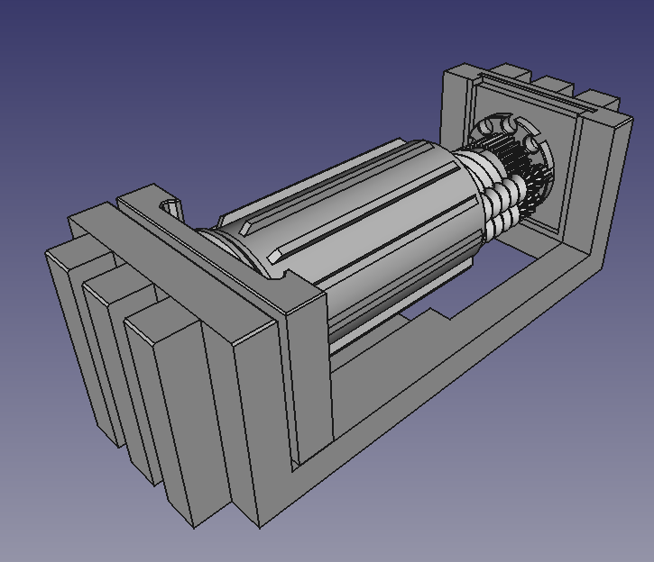

# vice-vise
A vise powered by an inverted planetary roller screw

It is a vise and a play thing with a removable mechanism. 3D print it, use it, understand it
and use a roller screw in your next project.

### Free

Open free hardware, please use as you see fit.

### Practical

The vise actually works and is quite nice to use. It has the benefit of being easy
to drive without a large handle. Simply roll your palm to spin it open or closed.

### Fun

The roller screw is fun to learn about and very satisfying to play with and inspect.
The internal core of the mechanism often ends up in one's hands when deep in thought. A true vice.

### Tangible

The roller screw mechanism has a few parameters that affect its performance.
Print different variations of the mechanism and swap them out to compare the effect.

Some run faster, some with more force, some feel more robust. Get a tactical
appreciation of the difference.

### Helpful

If you need a mechanism for linear movement, a roller screw may be good for you.

The FreeCAD model provided uses a parametric design, so you can adjust the model to your needs.
Remove the vise parts and add on anything else you like.

If you prefer to start over in a different CAD software, use the [`roller_screw_recipe.md`](roller_screw_recipe.md)
to see what steps to follow when designing an inverted planetary roller screw.

### Science

I discovered the equations for roller screws weren't working, and made up some new ones that you
can use.

The planetary roller screw (PRS) and inverted planetary roller screw (IPRS) have a subtle difference that mean
the dimensions of their components are different.

For a roller screw with a given number of thread starts and nut radius, the screw and roller radii are as follows:

|     | PRS | IPRS |
|---------|----------|----------|
| screw  | `nut * (starts - 2 ) / starts`    | `nut * starts / (starts + 2)`   |
| roller | `nut / starts` | `nut / (starts + 2)`  |

This is of interest for two reasons:
- It is required to design an inverted planetary roller screw.
- It shows that where a planetary roller screw must have >2 starts to have a non-zero screw size.

A inverted roller screw can therefore have 1 or 2 starts, which may be of interest when optimising for high mechanical advantage.

See [https://github.com/ceramic-sf/iprs-geometry](https://github.com/ceramic-sf/iprs-geometry) for a full exploration and derivation.
